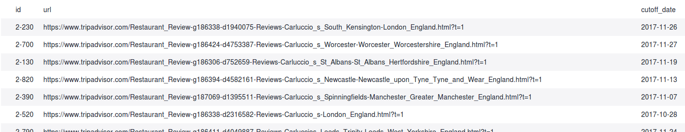

# apify-review-scrapers

# About
Apify crawlers with unified input and settings for monitoring of reviews.
You can set behavior and then wait for results.
Settings must be placed to crawler´s ```"customData"``` as JSON object.

# Modes

```java
{"mode": <mode>}
```
<b>"recheck"</b>
This setting requires to set at least additional ```"url_list"``` parameter(exception for keboola extractor where is possible to import table) which contains list of objects containing at least ```"URL"``` parameter with url of restaurant.

general settings:
```java
{
  "mode": "recheck",
  "url_list": [{"URL": "https://www.tripadvisor.com/Restaurant_Review-g186338-d814048-Reviews-Carluccios_St_Christophers_Place-London_England.html"]
}
```

optional settings:
- contain optional parameters in address objects:

```"cutoff_date"``` -> it scrapes all reviews to the Past before reaching this date - if date is not set -> searching all reviews

```"id"``` -> can be used for your needs, returned after page is scraped - returned as ```"ext_id"```

```java
{
  "mode": "recheck",
  "url_list": [{"URL": "https://www.tripadvisor.com/Restaurant_Review-g186338-d814048-Reviews-Carluccios_St_Christophers_Place-London_England.html", "cutoff_date": "2017-12-9", "id": "any_your_string"}]
}
```

<b>"normal"</b>
This setting requires to set at least additional ```"locations"``` parameter which contains list of START URLS. It will then listing all possible restaurants visible in these locations and it will extract all possible reviews and informations.

```java
{
  "mode": "normal",
  "locations": ["https://www.tripadvisor.com/Restaurants-g186338-London_England.html"]
}
```

<b>"get_urls_only"</b>
This setting requires to set at least additional "locations" parameter which contains list of START URLS. It will then listing all possible restaurants in these locations and return their urls.

```java
{
  "mode": "get_urls_only",
  "locations": ["https://www.tripadvisor.com/Restaurants-g186338-London_England.html"]
}
```
Data gotten from this mode needs to be deduplicated.

# Disable pagination in reviews
Optional parameter used for <b>switching off pagination</b> at reviews. It will override default settings of any mode.

```java
{"pagination": false}
```

# Keboola - importing data directly from table
You can set input table in keboola extractor settings. Table is uploaded as csv to key-value-store at your apify account and parameters ```storeId``` and ```key``` are merged to customData JSON object.

sample of input table optimized for Yelp, TripAdvisor crawlers: 


The resulting JSON POST to crawler looks like:

```java
{
  "mode": "recheck",
  "storeId": "some_store_id_...",
  "key": "key_containing_uploaded_csv"
}
 ```
<a href="https://www.apify.com/docs/api/v2#/reference/key-value-store/record/get-record">How to get record from apify kvstore?</a>
